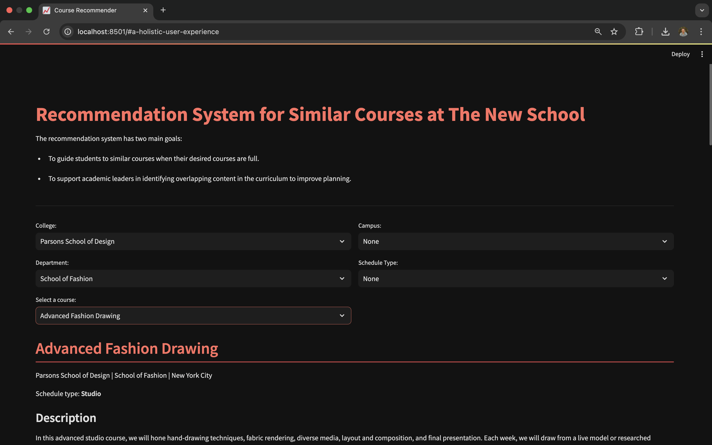
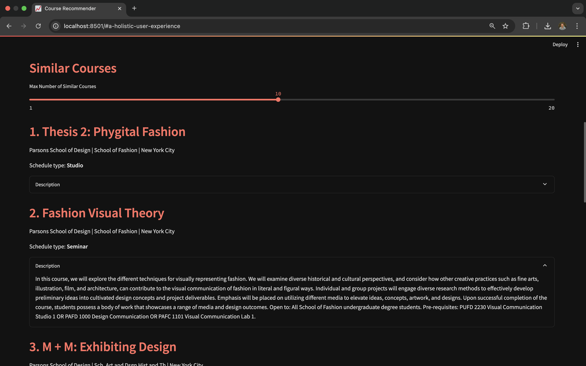

# Course Similarity App

## Overview

The **Course Recommender App** helps students at The New School find similar courses based on course descriptions. It also assists academic leaders in identifying overlapping content in the curriculum.

**Disclaimer:** I paused the development of this app, not sure when I'll get back to it.

## Features

- **Find Similar Courses**: Enter a course description to find similar courses.
- **Filters**: Refine search results by College, Campus, Department, and Schedule Type.
- **Export Results**: Save search results as an Excel file.
- **Upload Data**: Upload your own CSV file if needed.

## Installation

1. **Clone the repository**:

   ```bash
   git clone https://github.com/matipina/course_similarity.git
   cd course_similarity

2. **Install dependencies**:

    ```bash
    pip install -r requirements.txt

3. **Run the app**:

    ```bash
    streamlit run similar_courses_app.py

## Screenshots




TNS brand guidelines: https://drive.google.com/drive/folders/1rlk5fI_3eimVMj42QKhxa0yfIBKL4hqA
